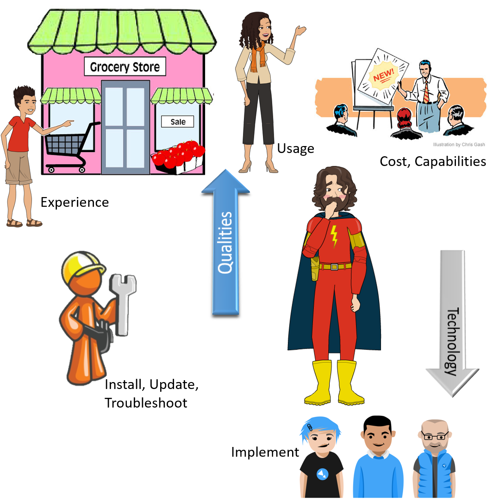

# Challenges

Customers see the effect of our code. That's what they pay for.
Why write requirements?

- Traceability
- Breaking down a requirement: Functional & non-functional
- Accountability
- Reliability of the product
- Legality / Contractual
- Legality / Regulatory (OBD standard for India)
- Ease of validation
- Feasibility
- Verification
- Derive hidden requirements

`Exercise: You want to buy an apartment. What do you need?`

- Location
- Budget / Cost: initial, recurring
- Number of bedrooms 'n' BHK
- Size of the apartment: carpet area, shared space, ...
- No of floor
- Ventilation
- Facilities
- Water resources
- Parking facility
- Vicinity
- Quality of work = experience
- what?

`Exercise: Your customer owns a store and needs to count visitors. What do they need?`

- Counter using a sensor = camera / automatic
- Clear visibility of face
- Footfall
- Alternative: Count the number of bills generated
- Display showing live counts - see it anywhere
- Budget for implementation: Type of sensor / SW development
- Timeline
- Feature-budgeting / Bill of material

## Challenge #1: Forces

## Challenge #2: Stakeholders

`Exercise: Who do you need for success? What do they need to do?`

- Visitors to the store. They need to visit
- Validation engineers. They check if system works as intended
- QA, test engineers. They ensure that it works without complaint?
- Worker / operator: they ensure power & internet connection
- Store-owner's cooperation (franchisee): permit, clarify...
- Marketing/advertising: They convey the benefit to users
- Sales, offers-campaigns: They provide incentive
- Grocery suppliers: They need information on the stock to deliver
- Customer Support: When it doesn't work, they handle the call
- Field engineers: Install, commission, repair, upgrade

## Challenge #3: Customer's Customer

`Exercise: How can 'counting' help visitors?`

- Visitors to the store. They need to visit. They need quick service
- Grocery suppliers: They need information on the stock to deliver.
Visitors see a well-stocked store + fresh supplies.
- Security - incoming + outgoing footfall & bills generated
- Savings and offers - to visitors when volume is high/low
- Saves customer time
- max limit of visitors in the store
- door delivery
- how?

## Challenges summary

