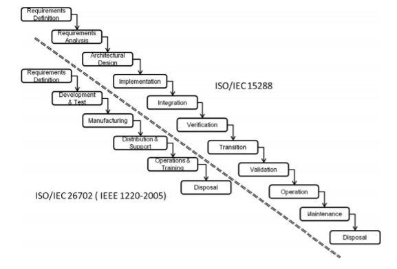

# Reality Sync

It is common to see requirements drift away from the implementation.
How do we keep the requirements useful?

## Tracking and Tracing Requirements

### Identification

Unique identifier, referenced in test cases and reports.

### Organization

The overall organization can be:

- Hierarchical / horizontal
- Vertical-slicing

Requirement Characteristics:

- Priority
- Stakeholders
- Status / Maturity
- Product Risk / Hazard
- Business Risk
- Project Risk

### Relationships

Requirement | Relationships | Requirement
---|---|---
Create-account | details | Enroll
Build | depends on | Compile
Development Environment | uses | Auto-complete
Send SMS | implements | Notify user

### Version Control

- date
- version

<<link illustration of version control

## Typical Requirement Workflow

## Failures in Tracking and Tracing

### Implementation overtakes requirements

- Because requirements are hard to change
- Cross-system changes are hard to capture
- Change in 3rd party dependency gives different behavior

### Legacy shackles are unknown

- Product with large installed base; unclear what users like
- Profits feed Organization-complexity and fear of change

## Strategies for Success

- [Hierarchy with bidirectional tracing](modeling-needs-tracing.md)
- [Tracking-tools with approval-workflow](modeling-needs-tools.md)
- [Requirements = Tests](modeling-needs-as-tests.md)
